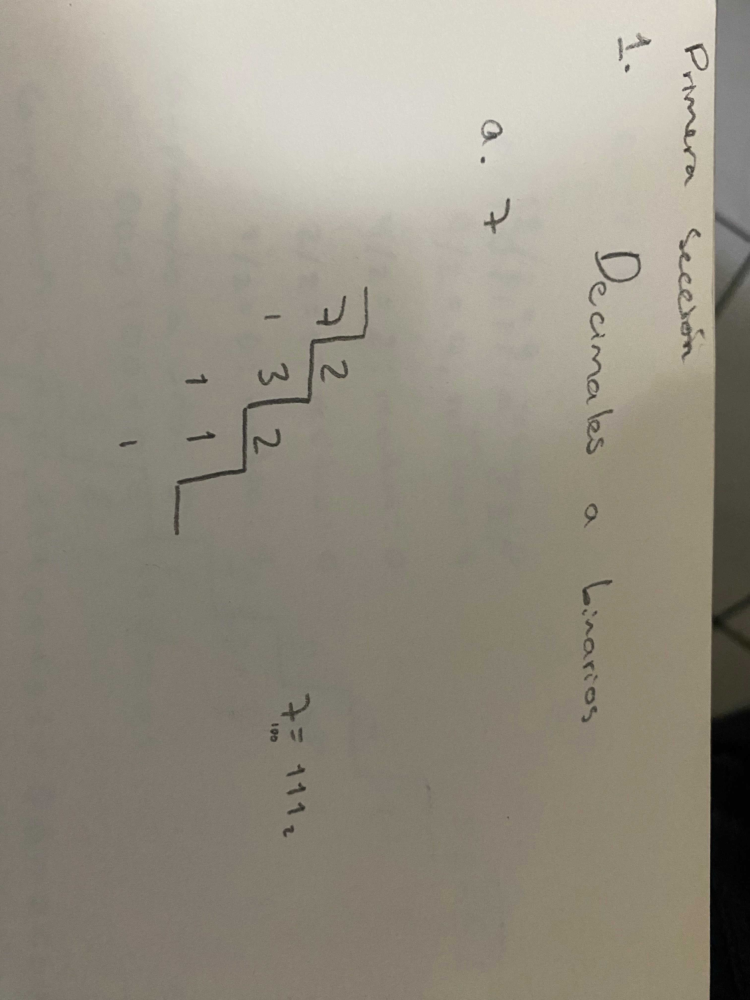
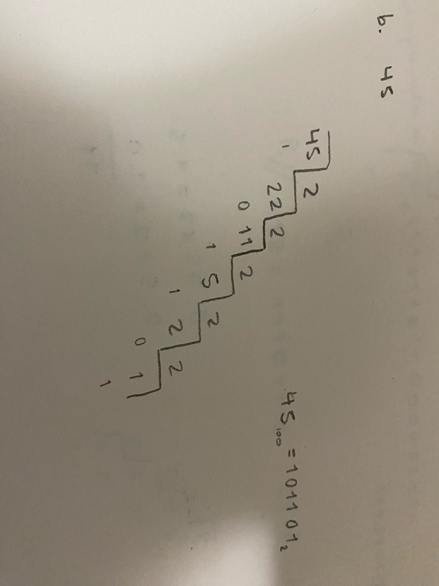
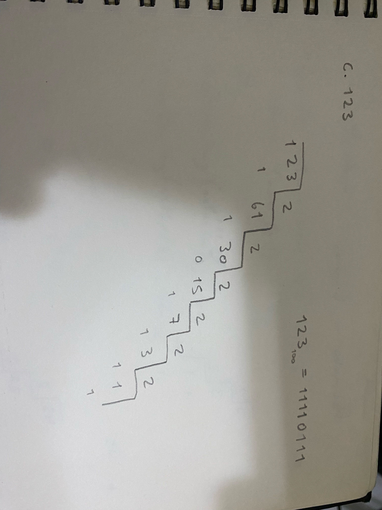
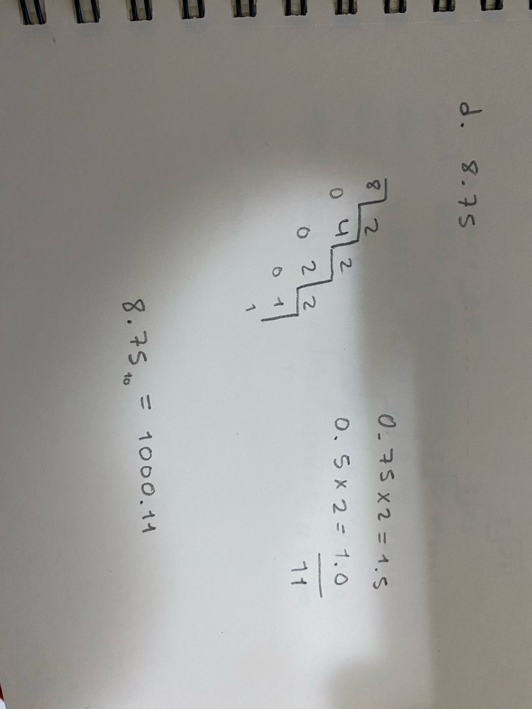
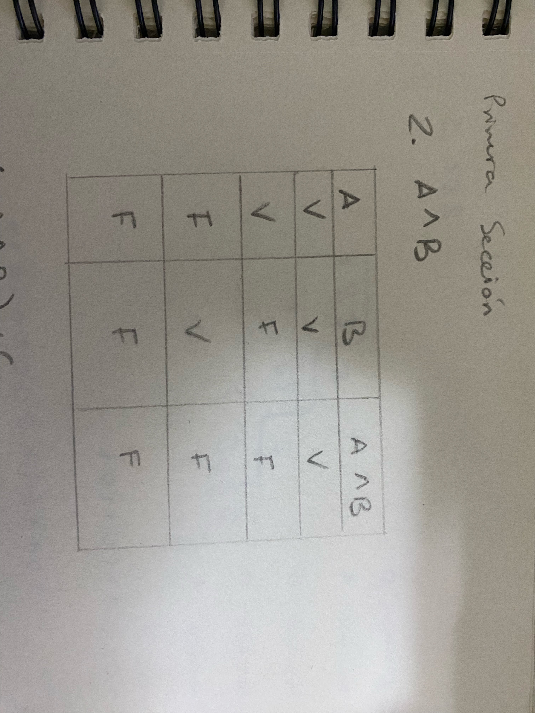
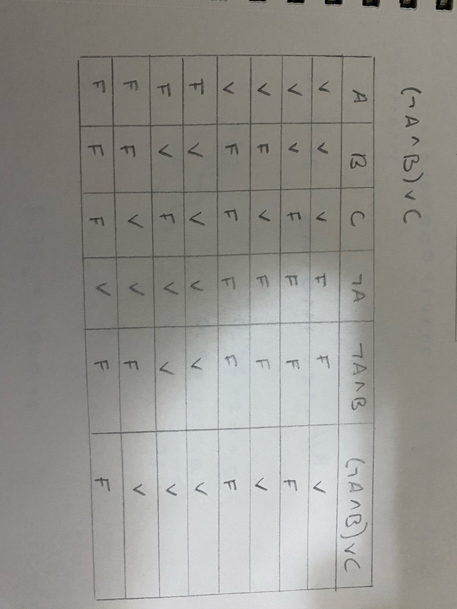
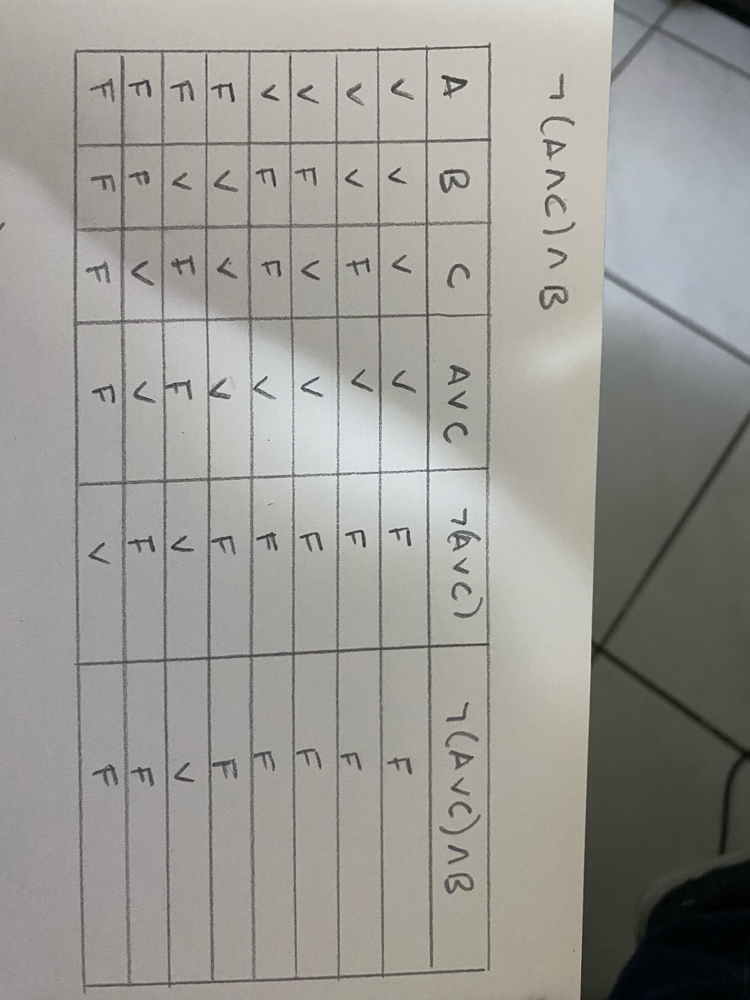
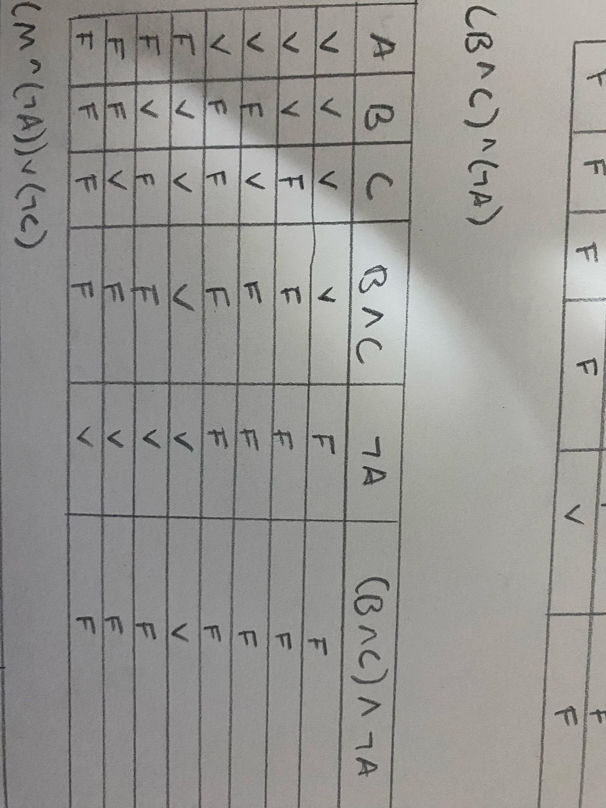
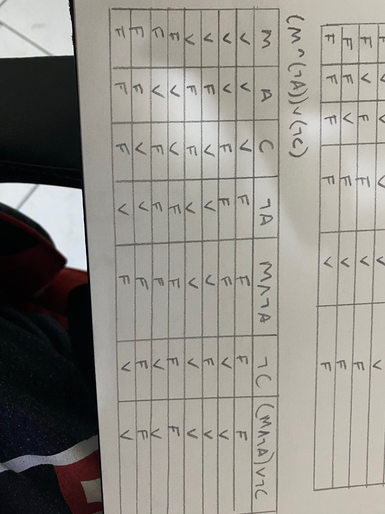

# Tarea 1: Matemática para Programación

Este repositorio contiene los ejercicios de la tarea 1 de la asignatura Matemática para Programación. Cada ejercicio está detallado con su respectiva solución y explicación. A continuación, encontrarás los ejercicios organizados por secciones.

## Tabla de Contenido
- [Primera Sección 1](#primera-sección-1)
- [Primera Sección 2](#primera-sección-2)
- [Segunda Sección 1](#segunda-sección-1)
- [Segunda Sección 2](#segunda-sección-2)

---

## Primera Sección 1

### Ejercicio A


### Ejercicio B


### Ejercicio C


### Ejercicio D


### Ejercicio E


---

## Primera Sección 2

### Ejercicio A


### Ejercicio B


### Ejercicio C


### Ejercicio D


### Ejercicio E


---


## Segunda Sección 1

### Ejercicio 1: Explicación

La función `evaluateRisk` evalúa el nivel de riesgo de un cliente bancario basado en su perfil. Recibe cuatro parámetros:

- `income` (ingresos): El ingreso anual del cliente en dólares.
- `hasLoans` (tiene préstamos): Un valor booleano (`true` o `false`) que indica si el cliente tiene préstamos activos.
- `latePayments` (pagos atrasados): El número de pagos atrasados que el cliente ha tenido.
- `isStudent` (es estudiante): Un valor booleano que indica si el cliente es estudiante.

La función devuelve un string con el nivel de riesgo del cliente: `'High'` (alto riesgo), `'Moderate'` (riesgo moderado), o `'Low'` (bajo riesgo).

#### Lógica de Evaluación

El nivel de riesgo se determina en base a las siguientes condiciones:

1. **Alto Riesgo** (`'High'`):
   - **Ingresos bajos y muchos pagos atrasados**: Si el cliente tiene ingresos menores a $20,000 y más de 3 pagos atrasados, se considera un alto riesgo.
   - **Préstamos y es estudiante**: Si el cliente tiene préstamos activos y es estudiante, también se considera de alto riesgo.

   **Condiciones en código**:

   ```javascript
   if (income < 20000 && latePayments > 3) {
       return 'High';
   }
   if (hasLoans && isStudent) {
       return 'High';
   }

2. **Riesgo Moderado** ('Moderate'): Si no cumple con las condiciones para alto riesgo, pero:

- Ingresos medianos y pocos pagos atrasados: Si los ingresos están entre $20,000 y $50,000 y ha tenido 2 o menos pagos atrasados.
- Préstamos, pero no es estudiante: Si tiene préstamos activos pero no es estudiante.

**Condiciones en código:**

   ```javascript
   if (income >= 20000 && income <= 50000 && latePayments <= 2) {
       return 'Moderate';
   }
   if (hasLoans && !isStudent) {
       return 'Moderate';
   }

3. **Bajo Riesgo** ('Low'): Si el cliente no cumple con ninguna de las condiciones anteriores, se considera de bajo riesgo. Esto ocurre cuando tiene pocos o ningún pago atrasado, y/o ingresos estables.

**Condición en código:**

   return 'Low';

Ejemplos:

- Ejemplo 1: Cliente con bajos ingresos y pagos atrasados:

   console.log(evaluateRisk(15000, true, 4, true)); // "High"

El cliente tiene ingresos de $15,000, más de 3 pagos atrasados y es estudiante. Cumple con la condición de "alto riesgo".

- Ejemplo 2: Cliente con ingresos medianos y pocos pagos atrasados:

   console.log(evaluateRisk(30000, false, 1, false)); // "Moderate"

El cliente tiene ingresos de $30,000 y ha tenido solo 1 pago atrasado, por lo que se considera de riesgo moderado.

- Ejemplo 3: Cliente con ingresos altos y sin préstamos ni pagos atrasados:

   console.log(evaluateRisk(60000, false, 0, false)); // "Low"

El cliente tiene ingresos de $60,000, sin préstamos ni pagos atrasados, por lo que se considera de bajo riesgo.


### Ejercicio 2: Explicación

La función recommendProduct recomienda un producto basado en la edad, membresía y historial de compras del usuario. Recibe tres parámetros:

age (edad del usuario): Un número que indica la edad del usuario.
isMember (miembro o no miembro): Un valor booleano (true o false) que indica si el usuario es miembro de un programa de fidelización.
purchaseHistory (historial de compras): Un objeto con las cantidades de productos comprados por categoría (tecnología, moda, otros).

Ejemplo de purchaseHistory:

   {
   tech: 6,
   fashion: 1,
   other: 2
   }


**Lógica de Recomendación**

La función decide qué tipo de producto recomendar basado en estas condiciones:

1. **Producto de Alta Tecnología** ('High-Tech Product'):

Miembro y al menos 5 productos tecnológicos: Si el usuario es miembro y ha comprado al menos 5 productos tecnológicos, se recomienda un producto tecnológico.
Edad entre 18 y 30 años y al menos 2 productos de moda: Si el usuario tiene entre 18 y 30 años y ha comprado al menos 2 productos de moda, se recomienda un producto tecnológico.

Condiciones en código:

   ```javascript
   if (isMember && purchaseHistory.tech >= 5) {
    return 'High-Tech Product';
   }
   if (age >= 18 && age <= 30 && purchaseHistory.fashion >= 2) {
    return 'High-Tech Product';
   }

2. **Producto de Moda** ('Fashion Product'):

No miembro y al menos 3 productos en total: Si el usuario no es miembro, pero ha comprado al menos 3 productos en total, se recomienda un producto de moda.
Edad entre 25 y 40 años: Si el usuario tiene entre 25 y 40 años, se recomienda un producto de moda.

3. **Producto Genérico** ('Generic Product'): Si el usuario no cumple con las condiciones para productos tecnológicos ni de moda, se recomienda un producto genérico.

Condición en código:

   return 'Generic Product';

Ejemplos:

- Ejemplo 1: Usuario miembro con productos tecnológicos:

   console.log(recommendProduct(22, true, { tech: 6, fashion: 1, other: 2 })); // "High-Tech Product"


El usuario tiene 22 años, es miembro y ha comprado 6 productos tecnológicos, lo que cumple con la condición para recomendar un producto tecnológico.

- Ejemplo 2: Usuario no miembro con al menos 3 productos comprados:

   console.log(recommendProduct(26, false, { tech: 1, fashion: 0, other: 2 })); // "Fashion Product"

El usuario tiene 26 años, no es miembro y ha comprado un total de 3 productos (sumando todas las categorías), lo que cumple con la condición para recomendar un producto de moda.

- Ejemplo 3: Usuario sin compras previas:

   console.log(recommendProduct(45, false, { tech: 0, fashion: 0, other: 0 })); // "Generic Product"

El usuario tiene 45 años, no es miembro y no ha comprado productos, por lo que se le recomienda un producto genérico.
